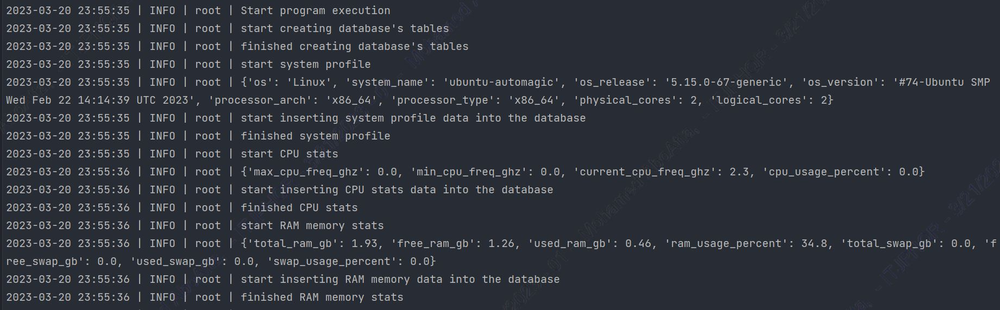
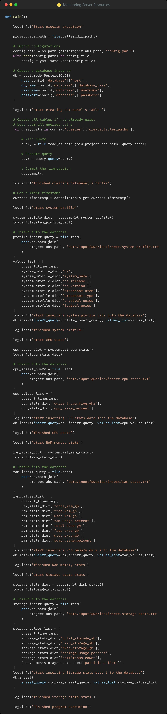

<!-- PROJECT SHIELDS -->
<!--
*** I'm using markdown "reference style" links for readability.
*** Reference links are enclosed in brackets [ ] instead of parentheses ( ).
*** See the bottom of this document for the declaration of the reference variables
*** for contributors-url, forks-url, etc. This is an optional, concise syntax you may use.
*** https://www.markdownguide.org/basic-syntax/#reference-style-links
-->

<a name="readme-top"></a>

[![LinkedIn][linkedin-shield]][linkedin-url]


<!-- PROJECT LOGO -->
<br />
<div align="center">
    

  <h3 align="center">Server Monitoring Tool</h3>

</div>


<!-- TABLE OF CONTENTS -->
<details>
  <summary>Table of Contents</summary>
  <ol>
    <li>
      <a href="#about-the-project">About The Project</a>
      <ul>
        <li><a href="#built-with">Built With</a></li>
      </ul>
    </li>
    <li>
      <a href="#getting-started">Getting Started</a>
      <ul>
        <li><a href="#libraries">Libraries</a></li>
        <li><a href="#packages">Packages</a></li>
        <li><a href="#service-accounts">Service Accounts</a></li>
        <li><a href="#known-exceptions">Known Exceptions</a></li>
      </ul>
    </li>
    <li><a href="#usage">Usage</a></li>
    <li><a href="#roadmap">Roadmap</a></li>
    <li><a href="#license">License</a></li>
    <li><a href="#contact">Contact</a></li>
  </ol>
</details>


<!-- ABOUT THE PROJECT -->
## About The Project



* Project Name: Server Monitoring Tool
* Version: v1.0.0

### Description

I developed this project to monitor the resources on the server
where I am hosting my personal portfolio website: automagicdeveloper.com

Here is the workflow of the project:
* Create the following tables in the PostgreSQL database, if
they don't already exist:
  * CPU Stats table.
  * RAM Stats table.
  * Storage Stats table.
  * System Profile table.
* Get a snapshot of the system profile and insert it in the database:
  * os
  * system_name
  * os_release
  * os_version
  * processor_arch
  * processor_type
  * physical_cores
  * logical_cores
* Get a snapshot of the CPU stats and insert it in the database:
  * max_cpu_freq_ghz
  * min_cpu_freq_ghz
  * current_cpu_freq_ghz
  * cpu_usage_percent
* Get a snapshot of the RAM stats and insert it in the database:
  * total_ram_gb
  * free_ram_gb
  * used_ram_gb
  * ram_usage_percent
  * total_swap_gb
  * free_swap_gb
  * used_swap_gb
  * swap_usage_percent
* Get a snapshot of the Storage stats and insert it in the database:
  * total_storage_gb 
  * used_storage_gb
  * free_storage_gb
  * storage_usage_percent
  * partitions_list: A dictionary of each partition with the following keys:
    * partition_name
    * partition_mountpoint
    * partition_fstype
    * partition_total_gb
    * partition_used_gb
    * partition_free_gb
    * partition_percentage

<p align="right">(<a href="#readme-top">back to top</a>)</p>


### Built With

This project was developed using the following tech stacks:

* Python

<p align="right">(<a href="#readme-top">back to top</a>)</p>


<!-- GETTING STARTED -->
## Getting Started

In this section, I will give you instructions on setting up this project locally.
To get a local copy up and running follow these simple steps.

### Libraries

* pip
  ```sh
  pip install psycopg2-binary==2.9.5
  ```
  ```sh
  pip install psutil==5.9.4
  ```
  ```sh
  pip install GPUtil==1.4.0
  ```
  ```sh
  pip install PyYAML
  ```

### Packages
* Logger
* datetimetools
* file
* postgredb
* system

### Service Accounts
* None

### Known Exceptions
* None

<p align="right">(<a href="#readme-top">back to top</a>)</p>


<!-- USAGE EXAMPLES -->
## Usage

### Screenshots



<p align="right">(<a href="#readme-top">back to top</a>)</p>


<!-- ROADMAP -->
## Roadmap

- [x] Create the needed tables in the PostgreSQL database, if
they don't already exist.
- [x] Get a snapshot of the system profile and insert it in the database.
- [x] Get a snapshot of the CPU stats and insert it in the database.
- [x] Get a snapshot of the RAM stats and insert it in the database.
- [x] Get a snapshot of the Storage stats and insert it in the database.

<p align="right">(<a href="#readme-top">back to top</a>)</p>

<!-- LICENSE -->
## License

Distributed under the MIT License. See `LICENSE.txt` for more information.

<p align="right">(<a href="#readme-top">back to top</a>)</p>


<!-- CONTACT -->
## Contact

Mohamed AbdelGawad Ibrahim - [@m-abdelgawad](https://www.linkedin.com/in/m-abdelgawad/) - <a href="tel:+201069052620">+201069052620</a> - muhammadabdelgawwad@gmail.com

GitHub Profile Link: [https://github.com/m-abdelgawad](https://github.com/m-abdelgawad)

<p align="right">(<a href="#readme-top">back to top</a>)</p>


<!-- MARKDOWN LINKS & IMAGES -->
<!-- https://www.markdownguide.org/basic-syntax/#reference-style-links -->
[linkedin-shield]: https://img.shields.io/badge/-LinkedIn-black.svg?style=for-the-badge&logo=linkedin&colorB=555
[linkedin-url]: https://www.linkedin.com/in/m-abdelgawad/
